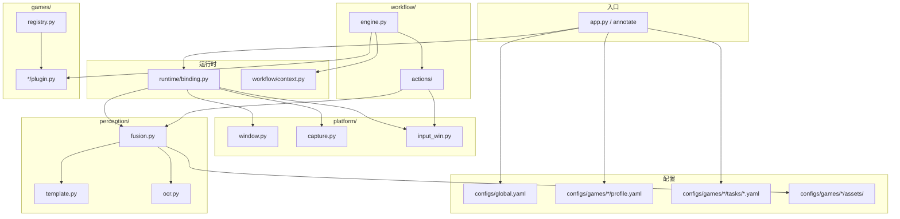

# 架构说明

OCR4game 采用 **配置驱动 + 分层插件** 设计：日常流程写在 YAML，识别与输入由通用引擎执行，游戏差异收敛到 Plugin 与 `configs/games/<id>/`。

## 分层结构

## 模块职责

| 模块 | 职责 |
|------|------|
| `resources.py` | 仓库根目录、配置路径、runs 目录等路径解析 |
| `config.py` | Pydantic 配置模型与 YAML 加载 |
| `runtime/binding.py` | 绑定窗口、截屏、输入、感知到 `RunContext` |
| `platform/` | Win32 窗口查找、客户区截屏、DirectInput 点击 |
| `perception/` | 模板匹配、OCR、锚点融合判定 |
| `workflow/engine.py` | 解析任务 YAML，调度步骤、重试、循环 |
| `workflow/actions/` | 可扩展动作注册表（`click_template`、`wait_for` 等） |
| `games/` | 每游戏一个 Plugin：预检、帧归一化、自定义动作、失败恢复 |

## 一次运行的数据流

1. CLI 加载 `global.yaml` 与 `profile.yaml`
2. `bind_runtime()` 按窗口标题找到游戏窗口并注入 `RunContext`
3. `GamePlugin.preflight()` 校验分辨率等游戏特有条件
4. `WorkflowEngine` 读取 `tasks/<name>.yaml`，逐步执行 `do` 列表
5. 每步动作：截屏 → `Perception.evaluate_anchor()` → 点击/等待/日志
6. 失败时保存截图到 `runs/<game>_<timestamp>/`，可选按 Esc 恢复

## 扩展点

- **新动作**：在 `workflow/actions/` 注册 handler，或在 Plugin 的 `register_actions()` 中追加
- **新游戏**：复制 `configs/games/_template/`，实现 `games/<id>/plugin.py` 并注册到 `registry.py`（见 [ADDING_A_GAME.md](ADDING_A_GAME.md)）
- **新日常**：只改 `tasks/*.yaml` 与 `assets/ui/` 模板，通常无需改 Python

## 设计原则

1. **配置与代码分离** — 流程与锚点在 YAML/PNG，Python 只承载引擎与插件
2. **相对 ROI** — 锚点 ROI 用 0~1 比例，换分辨率只改 `profile.yaml`
3. **识别可单测** — `tests/` 用 mock 或静态图验证引擎，不依赖启动游戏
4. **一步一快照** — 非 optional 步骤失败必留图，便于补模板
5. **单游戏单插件** — 通用能力下沉到 platform/perception/workflow
